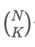

# [이항 계수 1](https://www.acmicpc.net/problem/11050)

## 📌 문제
자연수 N과 정수 K가 주어졌을 때 이항 계수 를 구하는 프로그램을 작성하시오.
### 입력
첫째 줄에 N과 K가 주어진다. (1 ≤ N ≤ 10, 0 ≤ K ≤ N)

### 출력
를 출력한다.

### 예제 입력 1

     5 2

### 예제 출력 1

     10


### 🧰 풀이 과정

1. 이항 계수 계산 방식
   - nCk = n!/(k!(n-k)!) 공식 활용
   - 분자: n부터 k개의 수를 곱함 (n × (n-1) × ... × (n-k+1))
   - 분모: k!를 계산 (1 × 2 × ... × k)


2. 최적화된 계산
   - 분자와 분모를 따로 계산하여 오버플로우 방지
   - 분자: 위에서부터 k개의 수를 순차적으로 곱함
   - 분모: 1부터 k까지의 수를 나눔


### 시간복잡도와 공간복잡도

      
      시간복잡도: O(K)
         - 분자 계산: K번의 곱셈
         - 분모 계산: K번의 나눗셈
         - K ≤ N ≤ 10 이므로 최대 10번의 연산
      
      공간복잡도: O(1)
         - 입력값 N, K: 상수 공간
         - 계산 결과 저장을 위한 result 변수
         - 추가 자료구조 사용하지 않음


### ✨ 새롭게 배운 점
1. 이항 계수 최적화 계산법
   - n!/(k!(n-k)!)를 직접 계산하지 않고 분자, 분모를 나누어 계산하여 효율적으로 처리


### 💡 성능 개선 포인트
1. 재귀를 사용한 구현 가능

```java
public static int binomial(int n, int k) {
   if (k == 0 || k == n) return 1;
   return binomial(n-1, k-1) + binomial(n-1, k);
}
```

2. DP를 사용한 구현도 가능

```java
int[][] dp = new int[N+1][K+1];
// 파스칼의 삼각형 활용
```
- 이 방식을 사용하면 더 큰 N, K 값에 대해서도 계산 가능
- 현재 문제의 제약조건(N ≤ 10)에서는 불필요한 최적화임