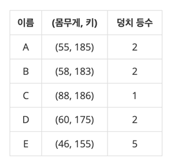

# [덩치](https://www.acmicpc.net/problem/7568)

## 📌 문제
우리는 사람의 덩치를 키와 몸무게, 이 두 개의 값으로 표현하여 그 등수를 매겨보려고 한다. 어떤 사람의 몸무게가 x kg이고 키가 y cm라면 이 사람의 덩치는 (x, y)로 표시된다. 두 사람 A 와 B의 덩치가 각각 (x, y), (p, q)라고 할 때 x > p 그리고 y > q 이라면 우리는 A의 덩치가 B의 덩치보다 "더 크다"고 말한다. 예를 들어 어떤 A, B 두 사람의 덩치가 각각 (56, 177), (45, 165) 라고 한다면 A의 덩치가 B보다 큰 셈이 된다. 그런데 서로 다른 덩치끼리 크기를 정할 수 없는 경우도 있다. 예를 들어 두 사람 C와 D의 덩치가 각각 (45, 181), (55, 173)이라면 몸무게는 D가 C보다 더 무겁고, 키는 C가 더 크므로, "덩치"로만 볼 때 C와 D는 누구도 상대방보다 더 크다고 말할 수 없다.

N명의 집단에서 각 사람의 덩치 등수는 자신보다 더 "큰 덩치"의 사람의 수로 정해진다. 만일 자신보다 더 큰 덩치의 사람이 k명이라면 그 사람의 덩치 등수는 k+1이 된다. 이렇게 등수를 결정하면 같은 덩치 등수를 가진 사람은 여러 명도 가능하다. 아래는 5명으로 이루어진 집단에서 각 사람의 덩치와 그 등수가 표시된 표이다.



위 표에서 C보다 더 큰 덩치의 사람이 없으므로 C는 1등이 된다. 그리고 A, B, D 각각의 덩치보다 큰 사람은 C뿐이므로 이들은 모두 2등이 된다. 그리고 E보다 큰 덩치는 A, B, C, D 이렇게 4명이므로 E의 덩치는 5등이 된다. 위 경우에 3등과 4등은 존재하지 않는다. 여러분은 학생 N명의 몸무게와 키가 담긴 입력을 읽어서 각 사람의 덩치 등수를 계산하여 출력해야 한다.

### 입력
첫 줄에는 전체 사람의 수 N이 주어진다. 그리고 이어지는 N개의 줄에는 각 사람의 몸무게와 키를 나타내는 양의 정수 x와 y가 하나의 공백을 두고 각각 나타난다.

### 출력
여러분은 입력에 나열된 사람의 덩치 등수를 구해서 그 순서대로 첫 줄에 출력해야 한다. 단, 각 덩치 등수는 공백문자로 분리되어야 한다.

### 제한
- 2 ≤ N ≤ 50
- 10 ≤ x, y ≤ 200


### 예제 입력 1

     5
     55 185
     58 183
     88 186
     60 175
     46 155

### 예제 출력 1

     2 2 1 2 5


### 🧰 풀이 과정

1. 입력 처리
   - N명의 사람 수 입력
   - 각 사람의 몸무게, 키를 2차원 배열에 저장


2. 등수 계산
   - 이중 for문으로 모든 사람 쌍 비교
   - 자신보다 덩치 큰 사람 수 + 1이 등수
   - 덩치가 크다 = 몸무게와 키 모두 커야 함


   
### 시간복잡도와 공간복잡도

      
      시간복잡도: O(N²)
         - 이중 for문으로 모든 쌍 비교
         - 외부 루프: O(N)
         - 내부 루프: O(N)
         - N은 최대 50이므로 시간 제한(1초) 내 해결 가능
      
      공간복잡도: O(N)
         - 입력 저장 2차원 배열: O(N)
         - StringBuilder: O(N)
         - N은 최대 50


### 💡 성능 개선 포인트
1. 비교 연산 최적화

```java
// 자신과의 비교는 제외
for (int j = 0; j < N; j++) {
    if (i != j && physical[i][0] < physical[j][0] && physical[i][1] < physical[j][1]) {
        count++;
        }
}
```
- 자기 자신과의 비교는 생략 가능한 방식만 알면 됨
- 이 문제에선 굳이 불필요
