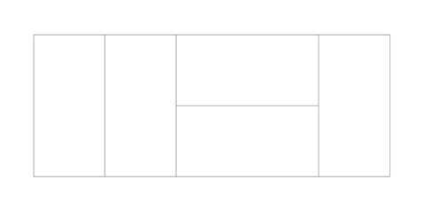

# [2×n 타일링](https://www.acmicpc.net/problem/11726)

## 📌 문제
2×n 크기의 직사각형을 1×2, 2×1 타일로 채우는 방법의 수를 구하는 프로그램을 작성하시오.

아래 그림은 2×5 크기의 직사각형을 채운 한 가지 방법의 예이다.



### 입력
첫째 줄에 n이 주어진다. (1 ≤ n ≤ 1,000)

### 출력
첫째 줄에 2×n 크기의 직사각형을 채우는 방법의 수를 10,007로 나눈 나머지를 출력한다.

### 예제 입력 1

     2

### 예제 출력 1

     2

### 예제 입력 2

     9

### 예제 출력 2

     55


### 🧰 풀이 과정

동적 계획법(DP)을 사용하여 해결

1. 문제 분석
   - 마지막에 세로로 놓는 경우와 가로로 놓는 경우 두 가지로 나누어 생각해보게 됨
   - n번째 방법의 수 = (n-1번째 방법의 수) + (n-2번째 방법의 수)
   - 이유: n번째를 채우는 방법은
     1. n-1번째까지 채우고 2×1 (세로로) 타일 하나를 놓는 방법
     2. n-2번째까지 채우고 1×2 (가로로) 타일 두 개를 놓는 방법


2. 초기값 설정
    - dp[1] = 1;  // 2×1 크기는 2×1 타일 하나로만 채울 수 있음
    - dp[2] = 2;  // 2×2 크기는 두 가지 방법으로 채울 수 있음


3. 점화식 도출
   - dp[i] = dp[i-1] + dp[i-2]


* 처음에 오버플로우 문제 발생

   ```java
   dp[i] = dp[i-1] + dp[i-2];
   result %= 10007;
   ```

* 이렇게 구현했다가 n이 커질수록 피보나치 수열처럼 dp[i] 값이 기하급수적으로 증가하여 오버플로우 문제 발생

  ```java
  dp[i] = (dp[i-1] + dp[i-2]) % 10007;
  ```
    
* int 대신 long을 사용한다 하더라도 오버플로우 발생 가능성 있기 때문에 매 계산마다 나머지 연산 수행하도록 수정함.
* (a + b) % m = ((a % m) + (b % m)) % m (모듈러 연산의 분배 법칙) 성질을 이용함


### 시간복잡도와 공간복잡도

      
      시간복잡도: O(N)
         - 각 i(3부터 n까지)에 대해 한 번의 덧셈과 나머지 연산 수행
         - 연산 횟수는 n-2번으로, O(n)
      
      공간복잡도: O(N)
         - n+1 크기의 1차원 배열(dp) 사용
         - 추가 변수들은 상수 공간


### ✨ 새롭게 배운 점
1. 오버플로우 처리
    - 큰 수의 연산에서 중간 결과값도 오버플로우 가능성 고려 필요
    - 모듈러 연산의 분배법칙을 활용한 해결 방법


2. 피보나치 유형의 DP 패턴
    - 현재 상태가 이전 두 상태의 합으로 표현되는 패턴 학습
    - 초기값 설정의 중요성 이해


### 💡 성능 개선 포인트
1. 공간 최적화

```java
// 현재: n+1 크기의 배열 사용
int[] dp = new int[n + 1];

// 개선: 최근 두 상태만 필요
int prev2 = 1;  // dp[i-2]
int prev1 = 2;  // dp[i-1]
int current;
```
   - dp[i] 계산에는 직전 두 개의 값만 필요 -> 굳이 배열 두지 않고 변수 2개 두면 됨
   - 전체 배열 대신에 결국 변수 3개만 사용하여 공간복잡도를 O(1)로 개선 가능