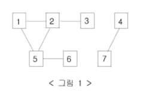

# [바이러스](https://www.acmicpc.net/problem/2606)

## 📌 문제
신종 바이러스인 웜 바이러스는 네트워크를 통해 전파된다. 한 컴퓨터가 웜 바이러스에 걸리면 그 컴퓨터와 네트워크 상에서 연결되어 있는 모든 컴퓨터는 웜 바이러스에 걸리게 된다.

예를 들어 7대의 컴퓨터가 <그림 1>과 같이 네트워크 상에서 연결되어 있다고 하자. 1번 컴퓨터가 웜 바이러스에 걸리면 웜 바이러스는 2번과 5번 컴퓨터를 거쳐 3번과 6번 컴퓨터까지 전파되어 2, 3, 5, 6 네 대의 컴퓨터는 웜 바이러스에 걸리게 된다. 하지만 4번과 7번 컴퓨터는 1번 컴퓨터와 네트워크상에서 연결되어 있지 않기 때문에 영향을 받지 않는다.

### 그림 1

어느 날 1번 컴퓨터가 웜 바이러스에 걸렸다. 컴퓨터의 수와 네트워크 상에서 서로 연결되어 있는 정보가 주어질 때, 1번 컴퓨터를 통해 웜 바이러스에 걸리게 되는 컴퓨터의 수를 출력하는 프로그램을 작성하시오.

### 입력
첫째 줄에는 컴퓨터의 수가 주어진다. 컴퓨터의 수는 100 이하인 양의 정수이고 각 컴퓨터에는 1번 부터 차례대로 번호가 매겨진다. 둘째 줄에는 네트워크 상에서 직접 연결되어 있는 컴퓨터 쌍의 수가 주어진다. 이어서 그 수만큼 한 줄에 한 쌍씩 네트워크 상에서 직접 연결되어 있는 컴퓨터의 번호 쌍이 주어진다.

### 출력
1번 컴퓨터가 웜 바이러스에 걸렸을 때, 1번 컴퓨터를 통해 웜 바이러스에 걸리게 되는 컴퓨터의 수를 첫째 줄에 출력한다.

### 예제 입력 1

     7
     6
     1 2
     2 3
     1 5
     5 2
     5 6
     4 7

### 예제 출력 1

     4

### 🧰 풀이 과정

핵심 알고리즘: DFS (깊이 우선 탐색)
DFS를 선택한 이유:
- 연결된 모든 컴퓨터를 방문해야 하는 문제에서 DFS는 "한 경로를 끝까지 탐색하면서" 연결된 모든 노드를 효과적으로 방문할 수 있음
- 재귀를 통한 구현이 직관적이고 간단함

1. 입력 처리
   - 컴퓨터 수(n), 연결된 쌍의 수(m) 입력받고
   - 2차원 배열로 그래프 표현 (인접 행렬로, 양방향이기 때문에 2차원 배열로)
   - visited 배열로 방문 처리

2. 큐에서 원소를 꺼낼 때마다 카운트를 증가시키는 방식으로 구현
   - 1번 컴퓨터부터 DFS 수행
   - 방문한 컴퓨터 체크 && 방문하지 않았는데 연결된 컴퓨터 발견할 때마다 result += 1
   - 재귀적으로 연결된 컴퓨터들 탐색

3. 컴퓨터 수 출력 (1번 컴퓨터 자신은 카운트 X)

### 시간복잡도와 공간복잡도

    시간복잡도: O(N²)
      - 각 정점마다 모든 정점과의 연결을 확인
      - 인접 행렬을 사용했기 때문에 모든 노드를 확인해야 함

    공간복잡도: O(N²)
      - graph 배열: N × N
      - visited 배열: N
      - 재귀 호출 스택: 최대 N

### 경계 케이스
- 모든 컴퓨터가 연결된 경우 → N-1 출력
- 1번 컴퓨터가 아무 컴퓨터와도 연결되지 않은 경우 → 0 출력
- 컴퓨터가 2대만 있고 서로 연결된 경우 → 1 출력

### ✨ 새롭게 배운 점
1. 그래프 표현 방법
   - 인접 행렬을 사용한 양방향 그래프 구현
   - 1-based 인덱싱을 위한 배열 크기 설정 (n+1) -> 컴퓨터 번호와 인덱스가 일치해서 헷갈리지 않음

2. DFS 이용하여 연결된 요소들 카운팅
   - 방문하지 않은 노드 발견 시 카운트 증가
   - 재귀를 통한 깊이 우선 탐색 구현
   - 방문 체크 잊지 말기